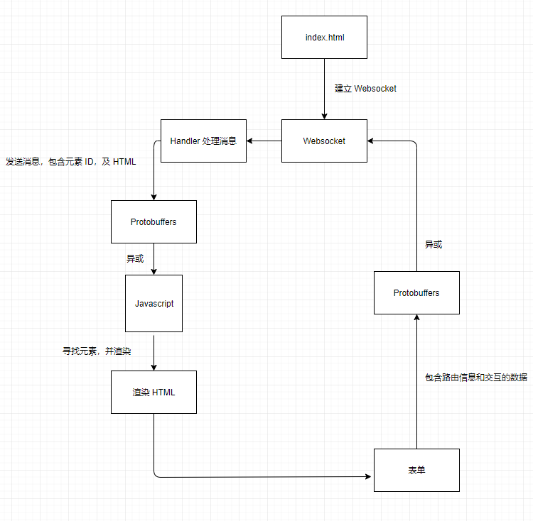
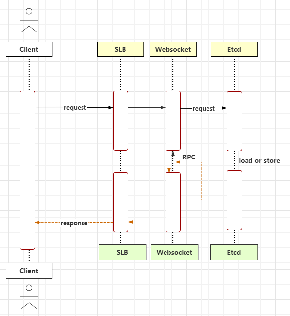
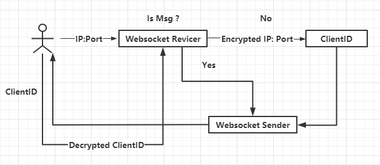
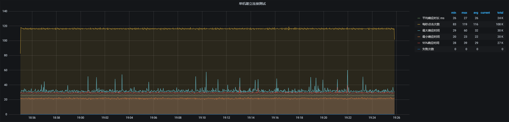

# EduHacks 2020 - 科技驱动在线教学的新工具、新方法和新技术

**由于需要参加 IELTS 的考试, 该项目仅实现了核心板块的内容, 查看完整的功能版图可参考 [requirements.md](requirements.md)**

# 分支的功能 :white_check_mark:

- 使用 Websocket 可实时查看连接的客户端以及客户端的角色(账号)
- Websocket 渲染前端页面 (管理端可以向客户端发送消息或断开指定客户端的连接)
- Protobuf 传输数据
- HTTP API 与 Websocket 进行交互
- 具有的中间件
    - csrf
    - session
    - jwt
    - logger
- 支持 RPC、高并发、分布式部署、横向扩容
- 前后端分离
- Gin & Gorm

# 数据库 :package:

- MongoDB 4.4
- PostgreSQL 12.4
- Redis 6.0.6

# 思路说明 💡

本项目主要围绕两点进行
1. 使用 Websocket 渲染前端
2. Protobuf 传输

- 使用 Websocket 的原因:
    1. Websocket 是全双工通讯, 这样能便于后台实时统计在线用户, 调整系统资源
    2. Websocket 服务器能主动给客户端发送消息, 例如在线上课时教师可以发布一次定时签到或者抢答利用 Websocket 来渲染前端, 其次可以对单一学生进行提问或者发送验证码
    3. Websocket 渲染前端的体验比 Javascript 回调要好, 也许服务端有一个耗时较长的任务, 如果使用 Javascript 可能需要多次向服务端发送请求获取状态, 但使用 Websocket 可以在服务端完成任务时, 主动向客户端发送状态, 无需多次请求
    4. Websocket 可以减少通信量, 只要建立起连接就一直保持, 在此期间可以源源不断的传送消息, 直到关闭请求, 也就避免了 HTTP 的非状态性和 HTTP 相比, 不但每次连接时的总开销减少了, 而且websocket的首部信息量也小, 通信量也减少了
    5. Websocket 在一定程度上能减少资源的消耗, HTTP 在 Nginx 等服务器的解析下, 然后再传送给相应的 Handler 来处理, 但 Websocket 一旦建立连接, 就可以与客户端持久地收发消息
    6. Websocket 可以更快地发送数据(特别是通过慢速链接), 因为连接已经建立, 因此不需要额外的数据包往返来建立TCP连接

- 使用 Protobuf 的原因:
    1. Protobuf 与语言、平台无关, 这意味着后期如果项目需要迁移其他语言, 依旧可以使用
    2. Protobuf 有数据序列化和结构化的能力
    3. Protobuf 扩展性、兼容性好, 可以更新数据结构, 而不影响破坏原有的旧程序, 这在往后的迭代更新中尤其重要
    4. Protobuf 大小较小, 能减少通信量
    5. Protobuf 可读性差, 可读性差能在一定程度上提升数据传输的安全性

- 保留 HTTP 接口, 可以更方便的在其他平台上扩展

- 使用 ORM, 能减少 SQL 的使用, 只需要向对象一样操作数据, 利于开发

- 前后端分离, 便于项目的开发和维护

- 业务流程

    

- 分布式架构

    

- 指定客户端

    使用 ClientID(IP:Port) 指定

    

# 并发测试 :globe_with_meridians:

测试详情请查看: [并发的测试](https://blog.htdocs.net/2020/09/28/1601226096221/#more) 

# HTTP API :zap:

请查看: [HTTP API](https://blog.htdocs.net/2020/09/29/1601321351876/)

# 负载均衡 SLB 部署 :pushpin:

请查看 [负载均衡部署](https://blog.htdocs.net/2020/09/26/1601114680969/#more)

# 分支说明 :page_facing_up:

| 分支 | 说明 |
|:---:|:----:|
| [当前分支](https://github.com/dirname/eduhacks2020) | 后端的代码 |
| [web](https://github.com/dirname/eduhacks2020/tree/web) | 前端的代码 |

# 已知问题 :bug:

- 在集群中, 无法获取所有节点的客户端信息
  
  由于当前在客户端建立时, 会在 Mongo 建立一个集合, 来储存客户端连接的信息, 每个节点创建的集合不一样, 因此无法获取所有节点的信息, 可以通过 Redis 来储存每一个节点的集合名来解决
