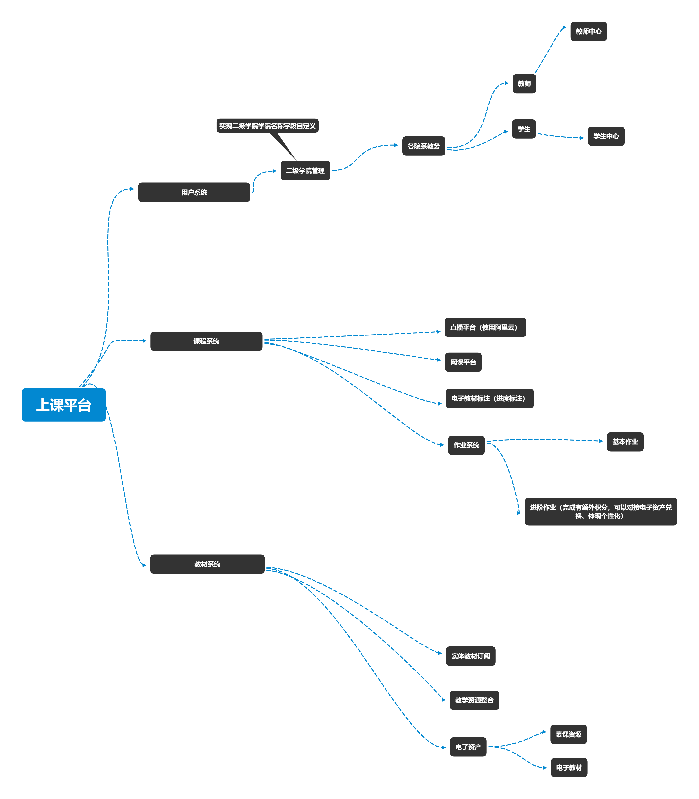

# EduHacks 2020 - 科技驱动在线教学的新工具、新方法和新技术

__请不要修改自己负责目录以外的东西，以免其他人同步时产生冲突，导致不能同步最新的代码__

# 项目说明

EduHacks 2020 创客马拉松大赛项目，项目创建于 2020-08-25，**由于时间关系，本项目将根据比赛进程和情况，进行迭代更新**

\* 有 _计划实现_ 标注的项目需求意味这不一定在当前版本中体现，而在后期迭代更新中实现

# 项目亮点

+ 使用 websocket 渲染前端 (_计划实现_)
+ protobuf 传输数据 (_计划实现_)
+ 数据防篡改 (例如刷课)
+ 通用性
    + 本系统在目前的基础上，可以满足大部分高校日常需求
    + 在后续迭代过程中，将添加系统级管理，面向拥有多个学校的教育集团，实现对多个学校的分配和管理
+ 学生个性化教育
    + 个性化作业
    + 全校选课
+ 积分制度
    + 可以通过学习获得积分
    + 积分可以兑换电子资产（慕课、电子教材）

# 索引

+ [文件目录](#文件目录)
+ [项目结构](#项目结构)
+ [项目需求](#项目需求)
    + [管理端](#管理端)
        + [教务管理](#教务管理)
        + [教师管理](#教师管理)
    + [客户端](#客户端)
        + [课程中心](#课程中心)
            + [我的课程](#我的课程)
            + [我的作业](#我的作业)
        + [请假审批](#请假审批)
        + [成绩查看](#成绩查看)
        + [疑问中心](#疑问中心)
        + [积分中心](#积分中心)
        + [选课中心](#选课中心)
    + [补充说明](#补充说明)
        + [直播平台](#直播平台)
        + [网课平台](#网课平台)
        + [电子教材标注](#电子教材标注)
+ [项目进度](#项目进度)
        

# 文件目录

| 文件目录 | 说明 | 负责人 |
|----|----|----|
| Go | 后端的实现 | 李浩楠 [@dirname](https://github.com/dirname) |
| html | 前端的实现 | 程泽培、蒋宗诚 |
| html/htdocs | 纯前端 | 程泽培 [@czpei](https://github.com/czpei) |
| html/live | 直播 | 蒋宗诚 [@github-wander](https://github.com/github-wander) |
| res | 资源目录 | Anyone |

# 项目结构

+ 管理端
    + 教务管理
        + 教师管理
        + 学生管理
        + 教材管理
        + 课程管理
    + 教师管理
        + 学生管理
        + 课程发布
        + 教材系统
+ 客户端
    + 面向学生

# 项目需求

## 管理端

管理端面向教师及教师以上角色，对于其中学生个性化的课程，如果涉及学分需要教务进行审核其余可以由教师进行审核

### 教务管理

+ 教师管理
    + 增删改查
    + 查看所有课程以及任课教师
+ 学生管理
    + 增筛改查
    + 审批选课
+ 教材管理
    + 审批教师提交的教材和慕课
    + 增删改查
+ 课程管理
    + 分配教师课程
    + 增删改查

### 教师管理

+ 教学中心
    + 发布直播
    + 网课发布
+ 作业中心
    + 发布作业
        - 基础作业发布
            1. 截止时间
            2. 提交方式
            3. 奖励积分
            4. 定时发布作业
        - 个性化作业发布 (非必须完成，完成后有额外积分奖励)
            1. 截止时间
            2. 提交方式
            3. 奖励积分
    + 作业情况
        + 查看学生的作业完成情况
            + 基础作业
                + 已完成
                + 未完成
            + 个性化作业
                + 已提交学生名单
                + 未提交学生名单
+ 学生管理
    + 课程审核
        + 无学分教师可自行审核
        + 有学分需要教务进行审核
    + 查看学生成绩
        + 可以导出
+ 请假中心
    + 对学生的请假进行审批记录
+ 成绩认定（平时分）
    + 设置公式自动进行计算
        + 考勤分
        + 作业分
+ 疑问中心
    + 对学生提出的疑问进行解答

## 客户端

客户端仅面向于学生

### 课程中心

#### 我的课程
+ 进入课程
    + 直播
    + 或网课

#### 我的作业
+ 按照课程查看发布的作业
    + 基础作业
        + 提交作业
        + 作业记录
    + 进阶作业
        + 提交作业
        + 作业记录

### 请假审批

+ 请假类型
    + 事假
    + 病假
    + 公假
+ 请假证明
    + 上传证明图片 (可空)
+ 请假课时

### 成绩查看

根据老师设置的公式实时计算

### 疑问中心

+ 提交疑问
    + 成绩
    + 课程
+ 回复解答
    + 教师的回复

### 积分中心

+ 积分明细

+ 兑换电子资产

### 选课中心

可以查看所有学院所有课程进行选修

## 补充说明

对于一些系统和细节的补充说明

### 直播平台

使用阿里云对接后，聊天室使用全新的 websocket 实现限时签到，防止学生不完成 (_计划实现_)

直播平台的开发 请参照于 [阿里云文档](https://help.aliyun.com/product/29949.html?spm=5176.13499635.0.0.24d42699lTWlVr)

### 网课平台

实现对课程的聊天记录，以及在中途随机不定时的弹出验证码

### 电子教材标注

查看教师的课程使用教材的进度

# 项目进度

| 时间 | 详细 | 操作人 |
|----|----|----|
|2020-08-26| [初始化项目](#初始化项目) | 李浩楠 |

## 初始化项目

修改 README.md